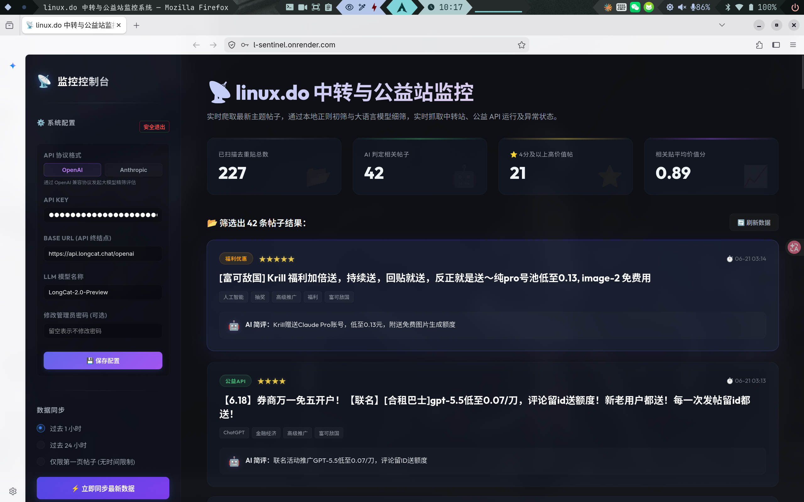

# linux.do 中转与公益站监控系统

[](#)
[](README.md)

一个面向 [linux.do](https://linux.do/) 论坛ের帖子监控与 AI 筛选看板。系统会抓取最新主题，先用本地关键词做粗筛，再调用大语言模型进行语义分类、摘要和价值评分，适合追踪中转站、公益 API、福利优惠和服务异常状态等信息。


## 预览



## 功能特点

- **增量抓取**：抓取 `linux.do/latest.json`，支持按最近 N 小时收集帖子。
- **去重处理**：自动跳过已入库帖子，减少重复处理和 LLM 调用成本。
- **AI 智能筛选**：本地关键词粗筛 + LLM 语义精筛，输出分类、摘要、相关性和 1-5 分价值评分。
- **多协议支持**：支持 OpenAI 兼容协议与 Anthropic 协议，可在管理界面动态配置。
- **FastAPI 后端**：提供帖子列表、统计数据、后台同步、同步进度和管理员配置接口。
- **Vue 3 前端**：提供监控看板、系统配置、手动同步和数据概览。
- **自动定时任务**：使用 APScheduler 每天 08:00 自动抓取过去 24 小时的增量帖子。
- **灵活数据库**：默认使用 SQLite，也可通过 `DATABASE_URL` 环境变量切换到 MySQL / TiDB Serverless。
- **支持 Docker**：提供多阶段构建，后端可直接托管构建后的前端静态资源。

## 技术栈

| 分层 | 技术栈 |
| --- | --- |
| 前端 | Vue 3, Vite, Axios |
| 后端 | FastAPI, Uvicorn, Pydantic |
| 数据存储 | SQLAlchemy, SQLite, MySQL / TiDB |
| 定时任务 | APScheduler |
| 爬虫 | `curl_cffi` / `requests` |
| 大语言模型 | OpenAI 兼容接口, Anthropic 接口 |
| 部署 | Docker, 兼容 Render 等平台 |

## 快速开始

### 1. 后端

```bash
pip install -r requirements.txt
uvicorn server:app --reload --port 8501
```

后端运行在 `http://localhost:8501`。首次启动时会自动创建数据库表。

### 2. 前端

```bash
cd frontend
npm install
npm run dev
```

前端运行在 `http://localhost:3000`。Vite 会将 `/api` 请求代理到 `http://localhost:8501`。

### 3. 首次登录

打开前端并使用默认密码登录：

```text
admin123
```

首次使用时，系统会要求你：
- 将管理员密码修改为更强的密码；
- 配置 LLM 提供商、API 密钥、API 基础 URL 以及模型名称。

## 配置说明

运行时配置存储在数据库中，可以通过管理员面板进行更新。

| 配置项 | 说明 |
| --- | --- |
| `ADMIN_PASSWORD` | 可选的初始管理员密码或云端密码重置值 |
| `DATABASE_URL` | 可选的数据库连接字符串；默认使用本地 SQLite `data.db` |
| LLM 提供商 (Provider) | `openai` 或 `anthropic` |
| LLM API 密钥 (Key) | 设置完成后存储在数据库中 |
| LLM 基础 URL (Base URL) | 支持官方端点或兼容的网关/代理 |
| LLM 模型 (Model) | 用于语义过滤的大语言模型名称 |

对于公开仓库，请勿在代码中提交真实的 API 密钥、数据库连接字符串、Cookie 或代理凭据。

## Docker 部署

构建镜像：

```bash
docker build -t linuxdo-monitor .
```

使用持久化的 SQLite 数据库运行：

```bash
touch data.db
docker run -d \
  -p 8501:8501 \
  --name linuxdo-monitor \
  -v "$PWD/data.db":/app/data.db \
  linuxdo-monitor
```

容器启动后，访问 `http://localhost:8501`。

常用命令：

```bash
docker logs -f linuxdo-monitor
docker stop linuxdo-monitor
docker start linuxdo-monitor
docker rm -f linuxdo-monitor
```

## 云端部署

该项目可以在 Render 等平台上部署为 Docker Web 服务。

推荐的环境变量：

```text
DATABASE_URL=mysql+pymysql://<user>:<password>@<host>:<port>/<database>?ssl_ca=/etc/ssl/certs/ca-certificates.crt
ADMIN_PASSWORD=<your-initial-admin-password>
```

注意事项：
- 如果 `DATABASE_URL` 以 `mysql://` 开头，应用会自动将其重写为 `mysql+pymysql://`。
- 如果部署平台会自动休眠闲置容器，建议使用外部的网站监控服务（如 Uptime Robot）定期请求 `/api/stats` 以保持调度器持续运行。
- 每日定时任务采用 `Asia/Shanghai` 时区，于每天 08:00 运行。

## 命令行使用

你可以在不启动 Web 服务器的情况下运行采集管道：

```bash
python main.py --hours 24
```

这将获取过去 24 小时内活跃的主题，对其进行筛选，并将结果写入配置的数据库中。

## 项目结构

```text
.
├── config.py              # 数据库 URL、爬虫限制和关键词配置
├── crawler.py             # linux.do 最新主题爬虫
├── database.py            # SQLAlchemy 引擎、会话和数据访问辅助函数
├── filter.py              # 关键词过滤和 LLM 语义过滤
├── main.py                # 采集管道和命令行入口
├── models.py              # ORM 模型
├── scheduler.py           # 每日后台定时任务
├── server.py              # FastAPI 应用和 REST API
├── Dockerfile             # 多阶段前端/后端镜像
├── requirements.txt       # Python 依赖项
├── 粘贴的图像.png          # README 预览图
└── frontend/
    ├── index.html
    ├── package.json
    ├── vite.config.js
    └── src/
        ├── App.vue
        └── main.js
```

## API 接口概览

| 请求方法 | 接口路径 | 是否需要认证 | 说明 |
| --- | --- | --- | --- |
| `GET` | `/api/topics` | 否 | 列出已保存的主题 |
| `GET` | `/api/stats` | 否 | 获取监控看板的统计数据 |
| `POST` | `/api/sync` | 是 | 启动后台同步任务 |
| `GET` | `/api/sync/progress` | 否 | 轮询同步进度 |
| `POST` | `/api/admin/login` | 否 | 管理员登录 |
| `POST` | `/api/admin/logout` | 是 | 管理员登出 |
| `GET` | `/api/admin/config` | 是 | 读取脱敏后的 LLM 配置 |
| `POST` | `/api/admin/config` | 是 | 更新 LLM 配置或密码 |
| `GET` | `/api/admin/setup-status` | 否 | 检查初始设置状态 |
| `POST` | `/api/admin/setup` | 是 | 完成首次运行设置 |

## 安全须知

- 部署后请立即修改默认密码。
- 将 LLM API 密钥保存在管理面板或部署环境变量中，切勿将其写入代码库。
- 手动同步和配置相关的接口需要管理员 Bearer Token。
- 公开的只读接口设计上会暴露已保存的主题数据和仪表盘统计信息。

## 许可证

目前尚未指定许可证。如果希望他人使用或修改此代码，请在发布仓库前添加许可证。
